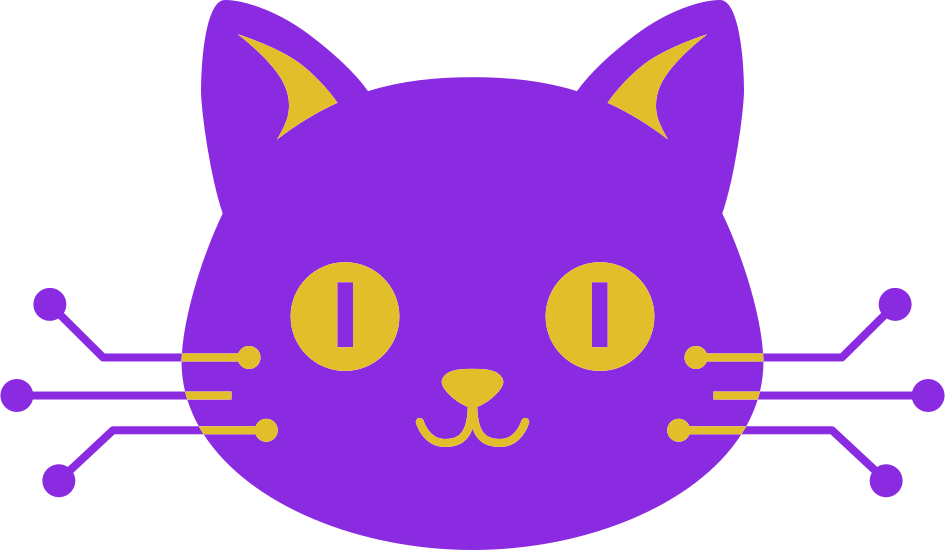

<div align="center">

# meowg1k

### Your purr-sonal AI sidekick for coding, writing, and automating anything — right from your terminal

[](https://github.com/retran/meowg1k/stargazers)
[](https://github.com/retran/meowg1k/network/members)
[](https://github.com/retran/meowg1k/releases/latest)
[](https://github.com/retran/meowg1k/actions/workflows/release.yml)
[](https://goreportcard.com/report/github.com/retran/meowg1k)
[](https://github.com/retran/meowg1k/blob/main/go.mod)
[](./LICENSE)



[Features](#-features) • [Installation](#-installation) • [Quick Start](#-quick-start) • [Documentation](#-documentation) • [Contributing](#-contributing)


</div>


## 🎯 Overview

**meowg1k** is a command-line interface that brings the power of modern LLMs (Large Language Models) into your terminal. Unlike interactive assistants, meowg1k is designed for **automation and scripting** — a Unix-philosophy tool that predictably transforms code into AI-enhanced results.

### Who Should Use This?

<table style="border: none;">
<tr style="border: none;">
<td style="border: none;">

- **Developers** — Integrate AI into shell workflows and boost productivity
- **DevOps Engineers** — Automate PR descriptions and code analysis in CI/CD pipelines
- **Security Engineers** — Run automated code checks using local, private models

</td>
</tr>
</table>


## ✨ Features

<table style="border: none;">
<tr style="border: none;">
<td width="50%" style="border: none;">

### 🤖 **Multi-Provider Support**
Works seamlessly with Gemini, OpenAI, Anthropic, OpenRouter, and more. Switch providers anytime.

### 🔒 **Local-First**
Run local LLMs via `llama.cpp` for complete privacy and offline access.

### ⚡ **Zero Dependencies**
Single native binary. Fast, lightweight, and ready to go.

</td>
<td width="50%" style="border: none;">

### 🎯 **Built for Automation**
Perfect for CI/CD pipelines, Git hooks, and batch processing — not conversations.

### 💰 **Cost Control**
Built-in token and request rate limiting for predictable spending.

### 📝 **Configuration as Code**
Manage all behavior through version-controlled `.yaml` files.

</td>
</tr>
</table>


## 📦 Installation

### Quick Install

```bash
# Using Go (requires Go 1.25.1+)
go install github.com/retran/meowg1k@latest

# Using Homebrew (macOS/Linux)
brew install retran/homebrew-meow-tap/meow
```

### Other Methods

<details>
<summary><b>Windows (Scoop)</b></summary>

```powershell
scoop bucket add meow-tap https://github.com/retran/homebrew-meow-tap
scoop install meow
```
</details>

<details>
<summary><b>Linux (.deb / .rpm)</b></summary>

Download from [releases page](https://github.com/retran/meowg1k/releases/latest)

```bash
# Debian/Ubuntu
sudo dpkg -i meowg1k_*.deb

# Fedora/RHEL
sudo rpm -i meowg1k_*.rpm
```
</details>

> 📚 For detailed installation instructions, see the [**Installation Guide**](./docs/01-INSTALLATION.md)


## 🚀 Quick Start

### 1️⃣ Initialize Your Project

```bash
cd your-project
meow init
```

This creates a `.meowg1k.yaml` file with sensible defaults.

### 2️⃣ Configure API Key

Get a free API key from [Google AI Studio](https://aistudio.google.com/app/apikey):

```bash
# Add to ~/.bashrc or ~/.zshrc
export MEOW_GEMINI_API_KEY="your-api-key-here"

# Reload your shell
source ~/.bashrc  # or ~/.zshrc
```

### 3️⃣ Start Using meowg1k

```bash
# Generate code from a prompt
echo "Create a hello world function in Python" | meow g

# Generate a commit message
git add .
meow commit

# Generate a Pull Request description
meow pullrequest --base main
```


## 📖 Documentation

<table style="border: none;">
<tr style="border: none;">
<td width="33%" style="border: none;">

### 🛠️ **Getting Started**
- [Installation Guide](./docs/01-INSTALLATION.md)
- [Configuration Guide](./docs/02-CONFIGURATION.md)
- [Command Reference](./docs/03-COMMAND-REFERENCE.md)

</td>
<td width="33%" style="border: none;">

### 📚 **Learn More**
- [Examples & Recipes](./docs/04-EXAMPLES.md)
- [Integrations Guide](./docs/05-INTEGRATIONS.md)
- [Core Principles](./docs/06-PRINCIPLES.md)

</td>
<td width="33%" style="border: none;">

### 🔧 **Support**
- [FAQ](./docs/07-FAQ.md)
- [Troubleshooting](./docs/08-TROUBLESHOOTING.md)
- [Report Issues](https://github.com/retran/meowg1k/issues)

</td>
</tr>
</table>

For a complete overview, visit our [**Documentation Index**](./docs/README.md).


## 🤝 Contributing

We welcome contributions! Whether it's bug reports, feature requests, or code contributions — we'd love your help.

- Read our [**Contributing Guidelines**](./CONTRIBUTING.md)
- Follow our [**Code of Conduct**](./CODE_OF_CONDUCT.md)
- Check the [**Project Roadmap**](./ROADMAP.md)


## 🔐 Security

Security is a top priority. If you discover a security vulnerability:

1. **Do not** open a public issue
2. Follow our [**Security Policy**](./SECURITY.md)
3. Report privately to the maintainers


## 📄 License

This project is licensed under the [**Apache License 2.0**](./LICENSE).


<div align="center">

### Made with ❤️ by Andrew Vasilyev and feline assistants Sonya Blade, Mila, and Marcus Fenix

**Happy coding with project meow! 🐱**

[⭐ Star us on GitHub](https://github.com/retran/meowg1k) • [🐛 Report Bug](https://github.com/retran/meowg1k/issues) • [💡 Request Feature](https://github.com/retran/meowg1k/issues) • [🔀 Contribute](https://github.com/retran/meowg1k/pulls)

</div>