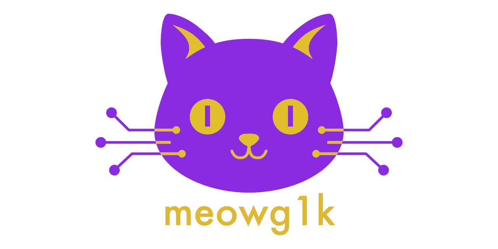

# meowg1k

[](https://github.com/retran/meowg1k/stargazers)
[](https://github.com/retran/meowg1k/network/members)
[](https://github.com/retran/meowg1k/releases/latest)
[](https://github.com/retran/meowg1k/actions/workflows/release.yml)
[](https://goreportcard.com/report/github.com/retran/meowg1k)
[](https://github.com/retran/meowg1k/blob/main/go.mod)
[](./LICENSE)

<div align="center">

### A purr-fectly scriptable CLI that brings AI superpowers to your terminal—automate commits, reviews, and workflows with feline precision



[Overview](#-overview) • [See It in Action](#-see-it-in-action) • [Key Features](#-key-features) • [Installation](#-installation) • [Quick Start](#-quick-start) • [Documentation](#-documentation) • [Contributing](#-contributing) • [Security](#-security) • [License](#-license)

</div>

## 🎯 Overview

**meowg1k** is a command-line tool that brings the power of modern LLMs (Large Language Models) into your terminal. The executable is `meow`. Unlike interactive assistants, meowg1k is designed for **automation and scripting** — a Unix-philosophy tool that predictably transforms code into AI-enhanced results.

### Who Should Use This?

**meowg1k** is built for professionals who value automation, reproducibility, and control:

- **Software Engineers** who want to integrate AI into their development workflow through shell scripts, editor integrations, and command-line tools
- **DevOps & Platform Engineers** who need to automate code quality checks, generate documentation, and standardize commit/PR descriptions across teams in CI/CD pipelines
- **Security Professionals** who require complete data privacy by running AI analysis on sensitive codebases using local models that never leave their infrastructure
- **Open Source Maintainers** who need consistent, high-quality automated documentation and review processes that can be version-controlled and shared with contributors

## 🎬 See It in Action

### 📝 Automated Commit Message Generation

<div align="center">


</div>

### 🔍 RAG-Powered Code Search and Q&A

<div align="center">


</div>

## ✨ Key Features

### 🔌 **Provider-Agnostic Architecture**

Switch between Gemini, OpenAI, Anthropic, OpenRouter, or self-hosted models with a simple configuration change. No vendor lock-in—your workflows remain portable across any AI provider.

### 🔒 **Privacy-First Design**

Run completely offline using local LLMs via `llama.cpp`. Your proprietary code never leaves your machine unless you explicitly configure a cloud provider. All API keys are held only in memory and never persisted.

### ⚡ **Native Performance, Zero Overhead**

Single statically-linked binary with no runtime dependencies. Starts instantly, uses minimal resources, and runs anywhere—from Docker containers to air-gapped servers.

### 🤖 **Automation-Native**

Built for scripting and CI/CD, not conversations. Predictable input/output model makes it perfect for Git hooks, pre-commit checks, automated reviews, and batch processing.

### 💰 **Transparent Cost Control**

Fine-grained rate limiting and token caps prevent unexpected bills. Configure request quotas, set spending limits per preset, and monitor usage—all in code.

### 📝 **Configuration as Code**

Every aspect of behavior is defined in version-controlled YAML files. Share configurations across teams, reproduce workflows exactly, and audit every decision.

### 🎯 **RAG-Powered Code Understanding**

Ask questions about your codebase using Retrieval-Augmented Generation. Semantic search finds relevant code using vector similarity, then LLMs provide context-aware answers grounded in your actual code.

## 📦 Installation

### ⚡ Quick Install

```bash
# Using Go (requires Go 1.25.2+)
go install github.com/retran/meowg1k@latest

# Using Homebrew (macOS/Linux)
brew install retran/homebrew-meow-tap/meow
```

### 🔧 Platform-Specific Installation

<details>

<summary><b>Windows (Scoop)</b></summary>

```powershell
scoop bucket add meow-tap https://github.com/retran/homebrew-meow-tap
scoop install meow
```

</details>

<details>

<summary><b>Linux (.deb / .rpm)</b></summary>

Download from [releases page](https://github.com/retran/meowg1k/releases/latest)

```bash
# Debian/Ubuntu
sudo dpkg -i meowg1k_*.deb

# Fedora/RHEL
sudo rpm -i meowg1k_*.rpm
```

</details>

> 📚 For detailed installation instructions, see the [**Installation Guide**](./docs/01-INSTALLATION.md)

## 🚀 Quick Start

### 1️⃣ Initialize Your Project

```bash
cd your-project
meow init
```

This creates a `.meowg1k.yaml` file with sensible defaults.

### 2️⃣ Configure API Key

Get a free API key from [Google AI Studio](https://aistudio.google.com/app/apikey):

```bash
# Add to ~/.bashrc or ~/.zshrc
export MEOW_GEMINI_API_KEY="your-api-key-here"

# Reload your shell
source ~/.bashrc  # or ~/.zshrc
```

### 3️⃣ Start Using meow

```bash
# Generate code from a prompt
echo "Create a hello world function in Python" | meow g

# Generate a commit message
git add .
meow draft commit

# Generate a Pull Request description
meow draft pr --base main

# Index your codebase for semantic search
meow index

# Search your code semantically
meow search "authentication logic"

# Ask questions about your codebase
meow ask "How does error handling work in this project?"
```

## 📖 Documentation

### 🛠️ **Getting Started**

- [Installation Guide](./docs/01-INSTALLATION.md)
- [Configuration Guide](./docs/02-CONFIGURATION.md)
- [Command Reference](./docs/03-COMMAND-REFERENCE.md)

### 📚 **Learn More**

- [Code Generation and Automated Workflows](./docs/04-GENERATION-AND-WORKFLOWS.md)
- [RAG and Code Search](./docs/05-RAG-AND-CODE-SEARCH.md)
- [Examples & Recipes](./docs/06-EXAMPLES.md)
- [Integrations Guide](./docs/07-INTEGRATIONS.md)
- [Core Principles](./docs/08-PRINCIPLES.md)

### 🔧 **Support**

- [FAQ](./docs/09-FAQ.md)
- [Troubleshooting](./docs/10-TROUBLESHOOTING.md)
- [Report Issues](https://github.com/retran/meowg1k/issues)

For a complete overview, visit our [**Documentation Index**](./docs/README.md).

## 🤝 Contributing

We welcome contributions! Whether it's bug reports, feature requests, or code contributions — we'd love your help.

- Read our [**Contributing Guidelines**](./CONTRIBUTING.md)
- Follow our [**Code of Conduct**](./CODE_OF_CONDUCT.md)
- Check the [**Project Roadmap**](./ROADMAP.md)

## 🔐 Security

Security is a top priority. If you discover a security vulnerability:

1. **Do not** open a public issue
2. Follow our [**Security Policy**](./SECURITY.md)
3. Report privately to the maintainers

## 📄 License

This project is licensed under the [**Apache License 2.0**](./LICENSE).

---

<div align="center">

### Made with ❤️ by Andrew Vasilyev and feline assistants Sonya Blade, Mila, and Marcus Fenix

**Happy coding with Project Meow! 🐱**

[⭐ Star us on GitHub](https://github.com/retran/meowg1k) • [🐛 Report Bug](https://github.com/retran/meowg1k/issues) • [💡 Request Feature](https://github.com/retran/meowg1k/issues) • [🔀 Contribute](https://github.com/retran/meowg1k/pulls)

</div>
